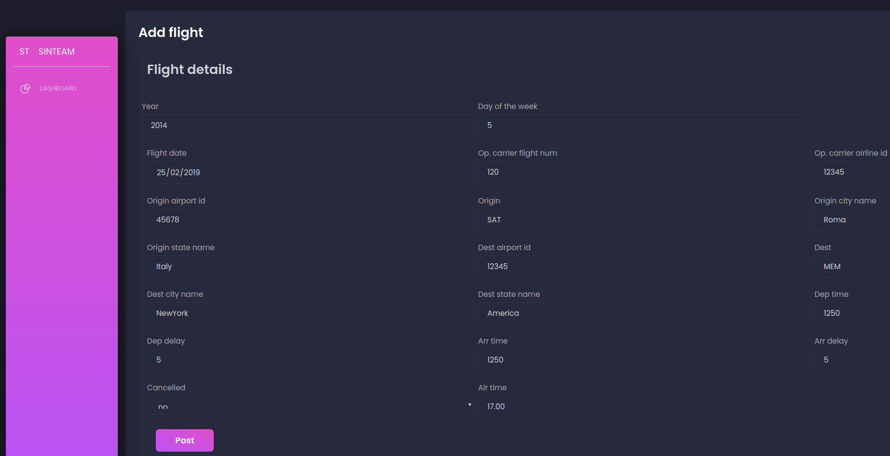
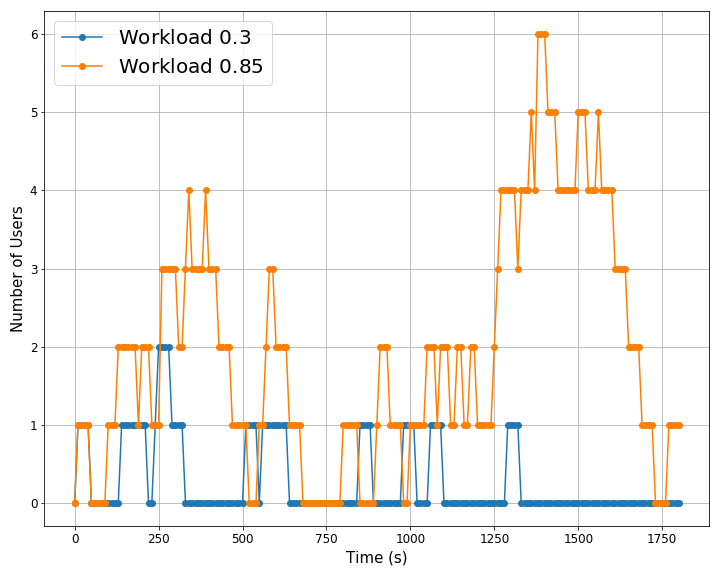
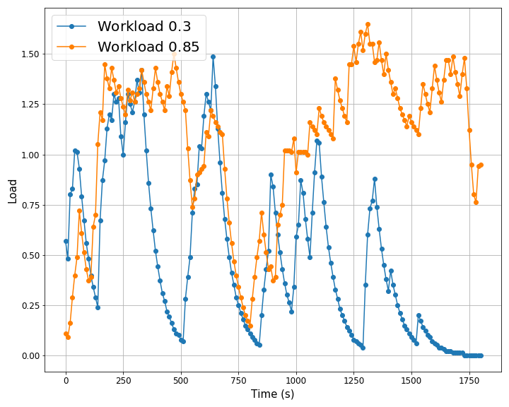
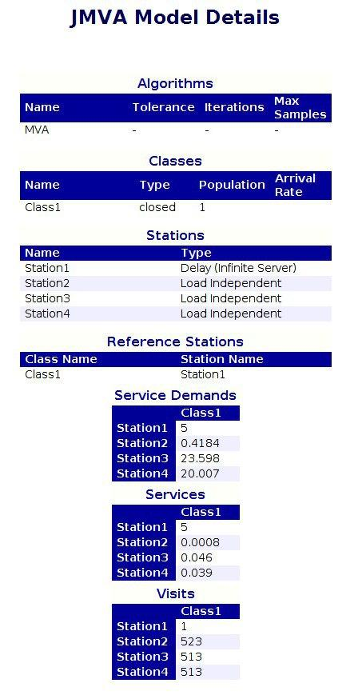
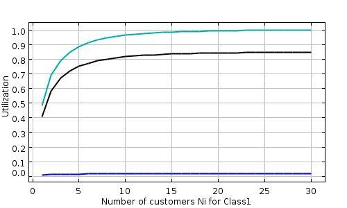
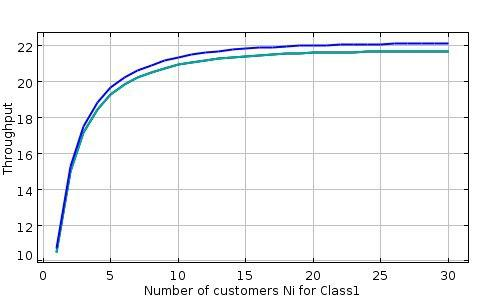
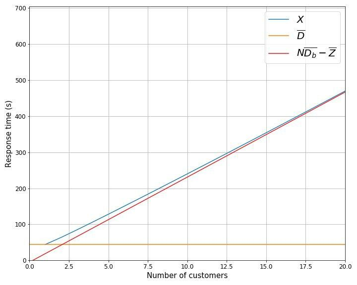

## Ca' Foscari University - Master's Degree in Computer Science
# Software performance and scalability
# Blockchain app Report

### Buoso Tommaso 864055, Cazzaro Lorenzo 864683, Cecchini Davide 862701, Di Campi Alessia 861844

# Introduction

The application uses the blockchain to manage a database of flying statistics, where each flight information is a transaction, so the application allows to:
- add a new transaction;
- retrieve a transaction based on the transaction id;
- retrieve all the transactions of a block.

Then, we added specific endpoints for different operations:
- filter_transactions: query the status of a flight given OP_CARRIER_FL_NUM and the DATE;
- average_delays: query the average delay of a flight carrier in a certain interval of time;
- flight_counter: given a pair of cities A and B, and a time interval, count the number of flights connecting city A to city B.

The application runs on a Raspberry Pi4b, that has these specifications:
- CPU: ARM-Cortex-A72 quad-core 1.5 GHz;
- RAM: 4 GB LP DDR4;
- HDD: Toshiba HDTB 310 EK3AA, 1 TB, 5400 rpm (connected to the Raspberry by an USB 3.0);
- OS: Raspbian 10, 32-bit.

The backend service of the web application is developed with Flask and interacts with the blockchain that stores the flying data. The requests are served by the application according to an FCFS discipline. During the execution the program manages one request at a time and takes advantage of a cache, that has a size of 20 MB, to improve the performance.
In particular, we use two types of caches: the "last" cache that keeps the last mined blocks, and the "random" cache that keeps the adjacent blocks of the last requested block. Each cache has the same size (10 MB each), and so it can keep 19 blocks.

The blockchain is stored in a single node, the same that provides the backend service, by using local files in the disk. A new block is mined and added to the blockchain once a minute by the backend, whether the are new transactions to add. Since each block can contain at most 1000 transactions, our initial blockchain contains 522 blocks of size equal to 1000 transactions (except for the last one).

The frontend service is also developed with Flask, it interacts with the backend service and is offered by the unique node where backend and blockchain reside. Some pictures of the functionalities offered are in [Fig. 1].

<figure>  <figcaption> Figure 1: frontend interface </figcaption> </figure> 

# Performance evaluation

To measure the performance indices of our application, we use the Tsung benchmark tool. Both the application and the Tsung monitor run on the same Raspberry machine. Even if they are in the same machine, the Tsung monitor does not require too many resources and the Raspberry only runs these two programs, so the execution of the application is not compromised and the results given by Tsung are a good approximation of the ones that would be obtained if the application was executed in a separate machine.

## Service time and variance

If we imagine the system as a monolithic queue, we can measure the expected value and the variance of the service time. To perform this test, we assume to have an interactive closed system with only one customer. 

A test consists of the customer that sends repeatedly the same request at the selected endpoint of the server with a small delay, 0.01 s, between each request.

The mean service time of each query is obtained by taking the average result over 15 runs of 30 minutes of the same test and the variance is obtained by taking 100 measures from the logs of the tests for each query. The results are shown in the table below. 

| Request | Mean Service Time | Variance |
|---|---|---|
| flight_counter | 40.49938 s | 1.38635 |
| average_delays | 41.67625 s | 1,46747 |
| filter_transactions | 41,565 s | 2.20881 |
| get_block | 1.43812 s | 0.0349 |
| get_transaction | 1.40188 s | 0.02117 |

The task of the first three queries in the table above consists in iterating over all the blockchain and making a tiny amount of computation for each block, while the get_block query consists in direct access to the block and get_transaction is served by using binary search for finding the right block and directly returning the transaction. As a consequence, the last two queries in the table have a small service time and the remaining three are very slow because of the exploration of all the blockchain.

The theoretical and empirical behaviour of the system when executing the first three queries is the same independently of the particular request. Therefore we decide to continue the analysis by testing only the flight_counter query in order to not overestimate the performance of our system.

## Workload tests

In this section, we model our system as an open system and we show the results of 4 complete tests with different workload intensities: 0.3L, 0.5L, 0.8L, 0.85L, where L is the maximum arrival rate determined from the expected service time estimated in the previous section.

Given L = 0,024692, we have:

|Fraction of the load| Workload intensity | Interarrival time |
|---|---|---|
|0.3|0.0074076|134.99792|
|0.5|0.0123459|80.99875|
|0.8|0.0197534|50.62422|
|0.85|0.020988|47.64632|

Then we compare these measurements with the lines predicted by M/G/1 and M/G/1/PS queueing systems.
For M/G/1 queueing system, the expected response time is given by

$$ E[R] = E[W] + μ^{-1} $$

where E[W] is the mean waiting time and corresponds to

$$ E[W] =  \frac{ρ + λμσ^2}{2(μ − λ)} $$

where μ is the expected service rate, $σ^2$ is the variance of the service time distribution, λ the arrival rate and ρ are equal to $\frac{λ}{μ}$.

For M/G/1/PS queueing system, the expected response time is given by

$$ E[R] = \frac{1}{μ − λ} $$

The results observed and predicted are shown in the table below, while in [Fig.2] are shown the mean response times of each model when the workload varies.

| Fraction | M/G/1 | M/G/1/PS | Mean response time tested|
|---|---|---|---|
| 0.3 | 49,18515 | 57,85625 | 50,891 |
| 0.5 | 60,76618 | 80,99875 | 59,1855 |
| 0.8 | 121,56659 | 202,49688 | 95,04 |
| 0.85 | 155,34459 | 269,99583 | 102,12 |

 <figure>  <figcaption> Figure 2: workload comparison </figcaption> <figure> 

If we look at the results and [Fig.2], we can notice that our application and the M/G/1 system perform better than M/G/1/PS system and at high load, the mean response time of our application stands out with respect to the one obtained by considering the M/G/1 queue.
In this test, the M/G/1 system performs better than the M/G/1/PS. Indeed, the performance of the M/G/1/PS queue is similar to the one of the M/M/1 thanks to the insensitivity property and, in this case, the variance of the service time obtained from the experiments seems to be better than the variance of the exponential distribution of the service time of the M/M/1.

The data gathered by Tsung allow making other considerations about the performance indices of our application.

 <figure> <figcaption> Figure 3: Transaction duration comparison with workloads 0.3L-0.85</figcaption> <figure> 

The comparison between the transaction duration over time in tests with different workloads is shown in [Fig. 3], where the results with workload 0.85L are in orange and with workload 0.3L in blue. The graph confirms the expected behaviour: the number and duration of the transactions become higher at high load, since the number of jobs in the waiting room increases. The maximum transaction duration when the workload is 0.3L is around 73s, while with workload 0.85L is around 223s.

 <figure>  <figcaption> Figure 4: Number of customer comparison with workloads 0.3L-0.85L </figcaption> <figure> 

It's interesting also to observe how the number of users in the system changes over time and with different workloads. [Fig. 4] represents the number of users with the respects to the time in two tests with different workloads. The orange line shows the trend of the number of users with workload 0.85L, while the blue line with workload 0.3L. In the test considered with the workload, 0.3L is observed only one peak of 2 customers in the system, while with workload 0.85L the peaks observed are two, one of 6 customers. As expected, the higher the workload, the higher the number of users in the system over time. The difference is evident only in a certain interval of time because of the randomness of the arrival process. Moreover, this confirms the observations of the previous paragraph, indeed the peaks of users in the system occur approximatively at the same time as the longer transactions.

Finally, the graph in [Fig. 5] shows the system load average on two tests with completely different workloads: load with workload 0.85L in yellow and 0.3L in blue.

 <figure>  <figcaption> Figure 5: System load average comparison with workloads 0.3L-0.85L </figcaption> <figure> 

The load of the system in test with workload 0.3L presents peaks with similar value to the ones obtained with workload 0.85, but the load remains high for a shorter period of time since the arrival rate of the requests is significantly lower. It's important to notice that the load increases a lot during the execution of a job. Because of that, it's observable a sort of correlation between the load graph and the transaction duration graph. 

## Queueing network model

In this section, we propose a queueing network model of our application [Fig. 6], composed of 4 stations:
- TERMINAL: a station that models the thinking time of the network, equal to 5 seconds;
- CPU: a station that models the processor, that has a service rate equal to $\frac{1}{0.0008}=1250$ j/s;
- DISK: a station that models the disk, that has a service rate equal to $\frac{1}{0.046}\approx22$ j/s;
- DELAY STATION: a station that models the additional computation time that the system introduces each time a block is read from the disk (fetch and integrity checks) and has a service rate equal to $\frac{1}{0.039}\approx26$ j/s.
  

 <figure>  <figcaption> Figure 6: schema of our model</figcaption> </figure> 

We obtained the service rate of the CPU by running a test in the setting to obtain the mean service time with all the blocks of the blockchain loaded in the cache so that we didn't have the overhead introduced by the delay station on the CPU and the mean service time obtained results to be a good approximation of the CPU mean service time. Differently, for the disk and the delay station, we run the same test by using a python profiler named "cProfile" that provides the execution time of the different program functions.

The routing of the system is deterministic. Each time a starting request arrives at the CPU, the CPU sets the "random" cache by forwarding the request to the disk and the delay station. Then, in the subsystem composed by disk and delay station, the request iterates for each block, that is read and added to the cache, so, since the cache size is 19 blocks, the request goes back from the delay station to the disk 18 times, and then goes back to the CPU.

After the cache is set, the CPU consumes the blocks in the cache by iterating on itself for each block. When all the 19 blocks of the cache have been processed by the CPU, the request goes again to the disk for replenishing the cache with the next 19 blocks, and so on and so forth. The last 19 blocks are not read from the disk because they are already in the "last" cache.

Only when all blocks of the blockchain are consumed by the CPU, the request goes back to the terminal.

To simplify the analysis of the system by using a queueing network, we decided to approximate the deterministic routing with a probablistic one, so we get:
- $p_1$ = 1/523, the CPU recives 523 request and only at the end goes back to the terminal;
- $p_2$ = 1 - $p_1$ - $p_3$ = 0.9465, probablity of a cache hit;
- $p_3$ = $\frac{27}{523}$ = 0,0516, probablilty of a cache miss (# of cache replenishing / # of blocks);
- $p_4$ = $\frac{1}{19}$, the cycle disk-delay station iterates 19 times before going back to the CPU;
- $p_5$ = 1 - $p_4$ = $\frac{18}{19}$;

The probabilistic routing for $p_4$ and $p_5$ are approximated because the 27th replenish of the random cache loads into the cache the blocks with ID 495-503 (the remaining blocks are already in the last cache). The remaining 10 places in the random cache are taken by the blocks 485-494 that are already in the cache from the previous cycle. Anyway, in our model, we assume that the last cycle loads 19 blocks in the cache all from the disk (like all the other cycles).

## Bottleneck and level of multiprogramming

Given our model, we have to find in the first place the system of traffic equations of the system, that gives us the relative visit ratios of the stations with respect to the reference station. From that, by knowing the expected service time of the stations, we can compute the service demand. The bottleneck of the system will be the station with the higher service demand.

The system of traffic equations is:

$$
\begin{cases}
    V_1 = V_2 p_1 \\
    V_2 = V_2 p_2 + V_4 p_4 + V_1 \\
    V_3 = V_2 p_3 + V_4 p_5 \\
    V_4 = V_3
\end{cases}
$$

and if we fix $V_1$ equal to 1, we get the relative visit ratios:

$$
\begin{cases}
    V_1 = 1 \\
    V_2 = 523 \\
    V_3 = 513 \\
    V_4 = 513
\end{cases}
$$

Now we can compute the service demand (of all the stations, except the terminal) in the form 

$$ \bar{D}_i = V_i \frac{1}{\mu_i} $$

so we get:

$$
\bar{D}_2 = 0.422 \\
\bar{D}_3 = 24 \\
\bar{D}_4 = 20
$$

From these results, we can notice that the bottleneck of the system is the disk station because it has a higher service demand. This result was expected, because the disk is the component of the system with the worst performance indices, and all stations have similar numbers of visits.

To complete the operational analysis, we have to find the maximum level of multiprogramming of the system. Since our system is a closed interactive system, we know the following bounds on the stationary throughput and the expected response time of the system

$$ X \leq \min\left(\frac{N}{\bar{D} + \bar{Z}}, \frac{1}{\bar{D}_b}\right) \\
\bar{R} \geq \max \left( \bar{D}, N \bar{D}_b - \bar{Z} \right) $$

where N is the number of jobs, $\bar{D}$ is the sum of all the service demands, except the reference station, $\bar{D}_b$ is the service demand of the bottleneck, and $\bar{Z}$ is the thinking time.

These bounds represent the asymptotes of the two performance measures. As we will see in the next section, the optimal level of multiprogramming is the number of jobs characterizing the intersection point of the two asymptotes and can be obtained by 

$$ N_{opt} = \frac{\bar{Z} + \bar{D}}{\bar{D}_b} \approx \frac{5 + 44.422}{24} \approx 2 $$

## JMT

In the last part of our analysis, we used JMT to perform the MVA analysis on our queueing network model to find the average performance indices. 

We parametrized the MVA with our service times and visits ratios, and we obtained a model with the values in [Fig. 7].

 <figure>  <figcaption> Figure 7: JMVA model details </figcaption> </figure> 

Notice that the service demands calculated by JMT are very similar to the ones obtained from the experiments.

Now we can take a look at the performance indices of the CPU, disk and delay station w.r.t. the level of multiprogramming of the system.

The utilization of the stations of our model is shown in [Fig. 8], in particular for the CPU (blue), disk (green) and delay station (black).

 <figure>  <figcaption> Figure 8: utilization of each station </figcaption> </figure> 

By looking to this graph we can notice, as expected from the previous analysis of the bottleneck, that the station that gets saturated faster is the disk station. Consistent with the $N_{opt}$ calculated previously, the graph shows that the utilization of the bottleneck starts to become critical after 2 customers in the system. 

 <figure>  <figcaption> Figure 9: throughput and number of customers of each station </figcaption></figure>

The saturation of the disk station influences the throughput and number of customers of the three stations. Indeed, as we can see from the left plot in [Fig. 9], where is represented the throughput of CPU (blue), disk (green) and delay station (black), while the bottleneck gets saturated, its throughput stops growing, like the others as a consequence. 

Moreover, since the bottleneck reaches the saturation, the number of costumers in the disk station keeps growing, and the number of customers in the other stations becomes constant. This observation is confirmed by the plot on the right in [Fig. 9], where is shown the number of customers in each station, with the disk in green, as the number of customers increases.

Finally, we confirm the observation in the previous chapter about the optimal number of customers by observing the throughput and mean response time of the aggregate system. 

 <figure>  <figcaption> Figure 10: throughput of the system with its asymptotes  </figcaption> </figure> 

In [Fig. 10] is represented the throughput of the entire system w.r.t. the number of customers in blue, while the two asymptotes obtained by the asymptotic operational analysis are in orange and red. As expected, with a number of customers greater than 2, the throughput grows slowly until it reaches the stable value near to 0.042, similar to the value of the asymptote given by the bottleneck law:

$$
\rho_b = \frac{X_b}{\mu_b} = \frac{X_1 \bar{V}_b}{\mu_b} = X_1 \bar{D}_b < 1 \\
\rightarrow X < \frac{1}{\bar{D}_b} \approx 0,0417
$$

We can also find the equation of the second asymptote, given by

$$
X = \frac{N}{\bar{R} + \bar{Z}} \leq \frac{N}{\bar{D} + \bar{Z}}
$$

If we look at the intersection of the two asymptotes, from [Fig. 10], we can notice that its abscissa coincides with the $N_{opt}$, i.e., 2.

 <figure>  <figcaption> Figure 11: response time of the system with its asymptotes </figcaption> </figure> 

The waiting time of the bottleneck grows linearly to the number of customers in the bottlenecks waiting room, so also the aggregate system response time keeps growing. As we can see from the picture [Fig. 11], the graph of the response time of the system respects the two asymptotes that can be found by using the asymptotic operational analysis, in particular

$$
\bar{R} \geq \max \left( \bar{D}, N \bar{D}_b - \bar{Z} \right)
$$

In conclusion, the analysis made by JMT confirms the results obtained by our benchmark and our theoretical analysis.

## Conclusions

Thanks to these benchmarks, we can notice that the response time of our application is quite high, but from the bottleneck analysis, we know that the disk is the component that has more impact on the overall performance of our system. However, the analysis allows us to make considerations about how we can improve the system. For example, the mechanical disk can be replaced by an SSD or by an online database to reduce the service demand of the storage station, and reduce the mean service time of the query taken in exam.
Notice that, when we improve the performance of the disk station, the delay station become the new bottleneck (because it has a service demand similar to the disk), making the additional improvement of the disk less effective. So, in order to improve the performance of the system, we need also to improve the performance of the delay station, i.e., using a better CPU or/and optimizing the encoding of the blocks to strings with an alternative data structure.

Before these tests, we thought that our application would have good performance even under heavy load, but the benchmarks showed us the importance of testing the performance and scalability of the application before its release.