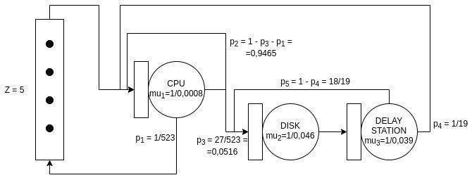
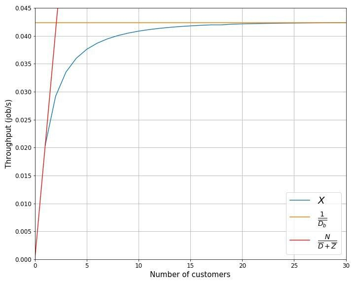
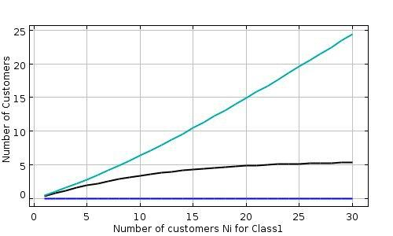

## Ca' Foscari University
# Software, performance and scalability
# Blockchain app Report

### Buoso Tommaso 864055, Cazzaro Lorenzo 8644683, Cecchini Davide 862701, Di Campi Alessia 861844

# Introduction

The application runs on a Raspberry Pi4b, that has these specifications:
- CPU: ARM-Cortex-A72 quad-core 1.5 GHz;
- RAM: 4 GB LP DDR4;
- HDD: Toshiba HDTB 310 EK3AA, 1 TB, 5400 rpm (connected to the Raspberry by an USB 3.0);
- OS: Raspbian 10, 32-bit.

The backend of the web application is developed with Flask and uses local files to store the blocks of the blockchain in the disk. During the execution the program takes advantage of a cache, that has a size of 20 MB, to improve the performances.

<TODO explain caching>

The application uses the blockchain to manage a database of flying statistics, where each flight information is a transaction, so the application allows to:
- add a new transaction;
- retrieve a transaction based on the transaction id;
- retrieve all the transactions of a block.

<TODO aggiungere immagini frontend>

Then, we added specific endpoint for different operations to benchmark later:
- filter_transactions: query the status of a flight given OP_CARRIER_FL_NUM and the DATE;
- average_delays: query the average delay of a flight carrier in a certain interval of time;
- flight_counter: given a pair of cities A and B, and a time interval, count the number of flights connecting city A to city B.

The blockchain is a single peer and the requests are served by the application according to an FCFS discipline. The block of the blockchain is mined once a minute.

# Performance evaluation

To measure the performance indices of our application, we use the Tsung benchmark tool. Both the application and the Tsung monitor run on the same Raspberry machine, but even if they are in the same machine, the Tsung monitor does not require too many resources and the Raspberry only runs this two programs, so its performance is not compromised.

## Service time and variance

If we imagine the system as a monolithic queue, we can measure its service time and variance. To perform this test, we assume to have a closed system with only one customer. The customer sends repeatedly the same request at the flight_counter endpoint of the server with a small delay, 0.01 s, between each request.

The mean service time obtained is averaged over 15 runs of 30 minutes and the variance is obtained by taking 100 measures from the log of a test.

| Request | Mean Service Time | Variance |
|---|---|---|
| flight_counter | 40.49938 s | 1.38635 |
| average_delays | 41.67625 s | 1,46747 |
| filter_transactions | 41,565 | 6,52621 |
<TODO add other queries>

For each benchmark, since the task requires to use a query and each query iterates over all the blockchain and makes a tiny amount of computation for each block, the theoretical and empirical behaviour of the system is the same independently of the particular request sent, so we decided to use the flight_counter query.

## Workload tests

In this section, we deal with an open system and we perform 4 tests with different workload intensities: 0.3L, 0.5L, 0.8L, 0.85L, where L is the maximum arrival rate determined from the expected service time estimated in the previous section.

Given L = 0,024692, we have:

|Fraction|Load|
|---|---|
|0.3|134,99792|
|0.5|80,99875|
|0.8|50,62422|
|0.85|47,64632|

The task asked to compare these measurements with the lines predicted by M/G/1 and M/G/1/PS queueing systems.
For M/G/1 queueing system, the expected response time is given by

$$ E[R] = E[W] + μ^{-1} $$

where E[W] is the mean waiting time and corresponds to

$$ E[W] =  \frac{ρ + λμσ^2}{2(μ − λ)} $$

where μ is the expected service rate, $σ^2$ is the second moment of the service time distribution, λ the arrival rate and ρ are equal to $\frac{λ}{μ}$.

For M/G/1/PS queueing system, the expected response time is given by

$$ E[R] = \frac{1}{μ − λ} $$

| Fraction | M/G/1 | M/G/1/PS | Mean response time tested|
|---|---|---|---|
| 0.3 | 49,18515 | 57,85625 | 50,891 |
| 0.5 | 60,76618 | 80,99875 | 59,1855 |
| 0.8 | 121,56659 | 202,49688 | 95,04 |
| 0.85 | 155,34459 | 269,99583 | 102,12 |

If we look at the results, we can notice that our tests and the M/G/1 system perform better than M/G/1/PS system, and at high load, our application performs better than M/G/1.
In this test, an M/G/1 system is better than an M/G/1/PS because the variance of the service time obtained is lower than the one that we can get from an exponential service time distribution of the M/G/1/PS with the same service rate.

<TODO add graphs and n of jobs>

## Queueing network model

In this section, we propose a queueing network model of our application, composed of 4 stations:
- TERMINAL: a station that models the thinking time of the network, equal to 5 seconds;
- CPU: a station that models the processor, that has a service rate equal to $\frac{1}{0.0008}$;
- DISK: a station that models the disk, that has a service rate equal to $\frac{1}{0.046}$;
- DELAY STATION: a station that models the additional computation time that the system introduces each time a block is read from the disk (fetch and integrity checks), and has a service rate equal to $\frac{1}{0.039}$.
  

We obtained the service rate of the CPU by running a Tsung test with all the blocks of the blockchain loaded in the cache so that we didn't have the overhead introduced by the delay station on the CPU. Differently, for the disk and the delay station, we ran a test while using a python profiler named "cProfile" that provide the execution time of the different program functions.

The routing of the system is deterministic, each time a starting request arrives in the CPU, the CPU sets the "random" cache by forwarding the request to the disk and the delay station. In the subsystem composed by disk and delay station, the request iterates for each block that is read and added to the cache, so, since the cache size is 19 blocks, the request goes back from the delay station to the disk 18 times, and then goes back to the CPU.

After the cache was set, the CPU consumes the blocks in the cache by iterating on itself for each block. When all the 19 blocks of the cache have been processed by the CPU, the request goes again to the disk for replenishing the cache with the next 19 blocks, and so on and so forth. The last 19 blocks are not read from the disk because they are already in the "last" cache.

Only when all blocks of the blockchain are consumed by the CPU the request goes back to the terminal.

To simplify the analysis of the system by using a queueing network, we decided to approximate the deterministic routing with a probablistic one, so we get:
- $p_1$ = 1/523, the CPU recives 523 (TODO check this number) request and only at the end goes back to the terminal;
- $p_2$ = 1 - $p_1$ - $p_3$ = 0.9465, probablity of a cache hit;
- $p_3$ = $\frac{27}{523}$ = 0,0516, probablilty of a cache miss (# of cache replenishing / # of blocks);
- $p_4$ = $\frac{1}{19}$, the cycle disk-delay station iterates 19 times before going back to the CPU;
- $p_5$ = 1 - $p_4$ = $\frac{18}{19}$;

The probabilistic routing for $p_4$ and $p_5$ are approximated because the 27th replenish of the random cache loads into the cache the blocks with ID 495-503 (the remaining blocks are already in the last cache). The remaining 10 places in the random cache are taken by the blocks 485-494 that are already in the cache from the previous cycle. Anyway, in our model, we assume that the last cycle loads 19 blocks in the cache all from the disk (like all the other cycles).

## Bottleneck and level of multiprogramming

Given our model, we have to find in the first place the traffic equations of the system, that gives us the relative visit ratios of the stations with respect to the reference station. From that, by knowing the expected service time of the stations, we can compute the service demand. The bottleneck of the system will be the station with the higher service demand.

The system of traffic equations is:

$$
\begin{cases}
    V_1 = V_2 p_1 \\
    V_2 = V_2 p_2 + V_4 p_4 + V_1 \\
    V_3 = V_2 p_3 + V_4 p_5 \\
    V_4 = V_3
\end{cases}
$$

and if we fix $V_1$ equal to 1, we get the relative visit ratios:

$$
\begin{cases}
    V_1 = 1 \\
    V_2 = 523 \\
    V_3 = 513 \\
    V_4 = 513
\end{cases}
$$

Now we can compute the service demand (of all the stations, except the terminal) in the form 

$$ \bar{D}_i = V_i \frac{1}{\mu_i} $$

so we get:

$$
\bar{D}_2 = 0.422 \\
\bar{D}_3 = 24 \\
\bar{D}_4 = 20
$$

From these results, we can notice that the bottleneck of the system is the disk station because it has a higher service demand. This result was expected, because the disk is the component of the system with the worst performance indices, and all stations have similar numbers of visits.

To complete the operational analysis, we have to find the maximum level of multiprogramming of the system. Since our system is a closed interactive system, we know the following bounds on the stationary throughput and the expected response time of the system

$$ X \leq \min\left(\frac{N}{\bar{D} + \bar{Z}}, \frac{1}{\bar{D}_b}\right) \\
\bar{R} \geq \max \left( \bar{D}, N \bar{D}_b - \bar{Z} \right) $$

where N is the number of jobs, $\bar{D}$ is the sum of all the service demands, except the reference station, $\bar{D}_b$ is the service demand of the bottleneck, and $\bar{Z}$ is the thinking time.

These bounds represent asymptotes of the two performance measure. As we will see in the next section, the optimal level of multiprogramming is the number of jobs characterizing the intersection point of the two asymptotes and can be obtained by 

$$ N_{opt} = \frac{\bar{Z} + \bar{D}}{\bar{D}_b} \approx \frac{5 + 44.422}{24} \approx 2 $$

## JMT

In the last part of our analysis, we used JMT to performe the MVA analysis on our queueing network model to find the average performance indices. 

We parametrized the MVA with our service times and visits ratios, and we obtained a model with this values:

Notice that the service demands calculated by JMT are very similar to the ones obtained from the experiment.

Now we can take a look to the utilization of the stations of our model, i.e., CPU (blue), disk (green) and delay station (black).

By looking to this graph we can notice, as expected from the previous analysis on the bottleneck, that the station that gets saturated faster is the disk station. Consistent with the $N_{opt}$ calculated previously, the graph shows that the utlization of the bottlenack starts to become critical after 2 customers in the system.

As expected, with a number of customers greater than 2, the throughput grows slowly until it reachs the stable value near to 22, similar to the value of the asymptote given by the bottleneck law

$$

\rho_b = \frac{X_b}{\mu_b} = \frac{X_1 \bar{V}_b}{\mu_b} = X_1 \bar{D}_b < 1 \\
\rightarrow X < \frac{1}{\bar{D}_b} \approx 0,0417

$$

Then we can find the equation of the second asymptot, given by

$$

X = \frac{N}{\bar{R} + \bar{Z}} \leq \frac{N}{\bar{D} + \bar{Z}}
 
$$

If we look at the intersection of the two asymptotes, we can notice that its abscissa coincides with the $N_{opt}$, i.e., 2.

From these graphs, we can observe that, while the bottleneck gets saturated, its throughput stops growing, like the others as a consequence. Moreover, since the thoughput of the bottleneck reached the saturation, the number of costumers in the disk station keep growing, and the number of customers in the other stations become constant. The waiting time of the bottleneck grows linearly to the number of customers in the bottlenecks waiting room, so also the system response time keep growing.

